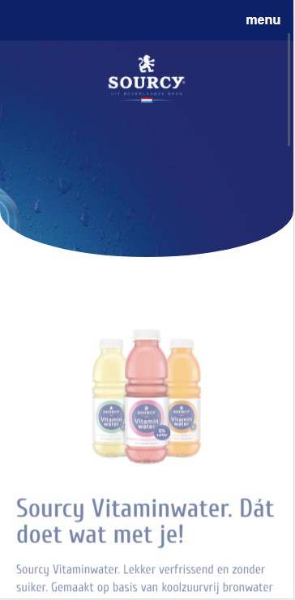

# Procesverslag

**Auteur:** Kai van Wezel

Markdown cheat cheet: [Hulp bij het schrijven van Markdown](https://github.com/adam-p/markdown-here/wiki/Markdown-Cheatsheet). Nb. de standaardstructuur en de spartaanse opmaak zijn helemaal prima. Het gaat om de inhoud van je procesverslag. Besteedt de tijd voor pracht en praal aan je website.

## Bronnenlijst

1. -https://www.sourcy.nl/-
2. -https://developer.mozilla.org/en-US/docs/Web/CSS/transition-
3. -https://www.youtube.com/watch?v=C_JKlr4WKKs&list=PLDyQo7g0_nsXlSfuoBpG5Fgz0Qe3IvWnA&index=2-

## Eindgesprek (week 7/8)

Deze week alles afgerond en online gezet. De animaties en transities werken. Helaas heb ik de intro-animatie (fade-in) niet zodanig gekregen dat deze op meerdere elementen werkt. Door een wat moeilijke periode heb ik ook niet zoveel kunnen werken aan de website als ik hoopte. Deze heb ik in een privébericht toegelicht bij Danny. Het parallax-effect op de homepagina is ook toegevoegd, dit bleek veel minder werk dan ik dacht.
Uiteindelijk ben ik wel tevreden met wat ik heb neergezet, maar ik had graag meer willen doen.

### Wat ging goed

Deze periode heb ik erg gemakkelijk de website semantisch correct kunnen opbouwen. De breakdownschets van de website scheelt heel erg en helpt bij het correct inschatten van de semantische waarde van een element. Daarnaast is de opmaak met css een goede oefening en ging ook dit weer sneller en gemakkelijker.

### Wat was lastig

Lastig is om de site natuurlijk exact na te maken. Hier streefde ik in het begin heel erg naar. Ik heb nog geprobeerd om de horizontale slider met knoppen aan de praat te krijgen zodat deze oneindig door draait maar dat is helaas niet gelukt. Andere animaties en transities zijn wel gelukt. Het was ook nog even puzzelen om alle opmaak in één css bestand te krijgen. Ik had gewerkt met twee bestanden, elke pagina zijn eigen bestand.

**Screenshot(s):**

_Screenshot 1_

_Screenshot 2_

_Screenshot 3_

_Screenshot 4_

## Voortgang 3 (week 6)

### Stand van zaken

Begonnen met de het werkend krijgen van het menu. Het menu wordt nu in het scherm geanimeerd op beide pagina's. Met de javascript wacht ik op een klik om zo een class toe te voegen aan het navigatie-element. De animatie maakt duidelijk waar het menu vandaan komt en dat het over de pagina heen ligt. Ook ben ik begonnen met het maken van een intro-animatie voor tekst elementen. Deze werkt op het moment alleen nog niet.

In de komende weken (vakantie) wil ik nog aan de slag met die transition en een animatie toevoegen aan de pagina.

**Screenshot(s):**

_Screenshot 1_

_Screenshot 2_

## Voortgang 2 (week 5)

### Stand van zaken

Beide pagina's bevatten hun opmaak zoals de website van Sourcy zelf eruit ziet. Inmiddels is met wat hulp het horizontale scroll element ook gelukt. Nu gaan beginnen met Javascript en de surface plane. Verder was het deze week moeilijk om motivatie te krijgen om aan het werk te gaan. Ik vind het moeilijk om hard aan de slag te gaan en ben eigenlijk toe aan vakantie voor mijn gevoel.

Qua semantiek e.e.a. aangepast in de html wat voor wat moeilijkheden zorgde bij de sliders, maar dat is opgelost.

**Screenshot(s):**

_Screenshot 1_

De eerste pagina is volledig opgemaakt zoals die van Sourcy.

_Screenshot 2_

Productpagina is ook werkend, alleen de onderste producten slider werkt niet altijd mee. De ene keer geeft ie wel goed weer en soms loopt die net scheef. Deze moet ik nog even aandacht geven.

### Agenda voor meeting

-samen met je groepje opstellen-

| Kai                                          | Nienke                      | Lisa                             | Jeroen             |
| -------------------------------------------- | --------------------------- | -------------------------------- | ------------------ |
| Hoe veel wordt verwacht van de surface plane | Advies op css en javascript | Tips over animeren en javascript | Footer en carousel |
| Mag je libraries gebruiken?                  | Niet ver, nog ombouwen      |                                  | Code oke?          |
|                                              |                             |                                  |                    |

## Voortgang 1 (week 3)

### Stand van zaken

Eerste pagina qua markup gaat goed. Moeite gehad met overlappende content maar dat is opgelost.
Ik kon helaas het lettertype van Sourcy niet terugvinden dus ik heb een gelijksoortig lettertype gepakt.
Ben nog niet begonnen met javascript. Ik wil eerst alle css afmaken voordat ik ga programmeren. Dan is voor mij duidelijker wat er geprogrammeerd moet worden.

**Screenshot(s):**

_Screenshot 1_

Pagina ziet er hetzelfde uit. Menubalk is over alles heen gepositioneerd zodat deze altijd in beeld is. Kleur moet uiteraard nog aangepast worden, maar dit is voor het overzicht.

_Screenshot 2_

De productenslider werkt in principe. Alleen de knoppen moeten nog gepositioneerd worden en dan komt er javascript aan te pas. De 3 afbeeldingen moeten "snappen' (spreek uit als: "sneppen") en ook oneindig kunnen rondgaan.

### Agenda voor meeting

-samen met je groepje opstellen-

| Kai                                     | Nienke                           | Lisa                             | Jeroen           |
| --------------------------------------- | -------------------------------- | -------------------------------- | ---------------- |
| Verschil tussen mijn pagina en de echte | Overall look van huidige stavaza | Beste aanpak navigatie die slide | en dan ik dat    |
| Semantiek                               | Semantiek                        | Bewerking van ul                 | dit wil ik zeker |
| Bronnen (evt.)                          | Beste aanpak voor straks         | Iconen in een rij krijgen        | ...              |

### Verslag van meeting

Semantiek kan beter, verder zijn we goed bezig. Wat betreft de overeenkomsten hoeft het niet 1 op 1 te zijn, er mag een kleine variatie in zitten. Hierna ga je tenslotte met de surface plane aan de slag, dus als het goed is komt het er ook anders uit te zien.

Div's veranderd in ul > li, en enkele h1 veranderd in h2.

## Breakdownschets (week 1)

**breakdown home-pagina**

**breakdown van product-pagina**

## Intake (week 1)

**Je startniveau:** zwart

**Je focus:** surface plane

**Je opdracht:** https://www.sourcy.nl

**Screenshot(s) van de eerste pagina (small screen):**

**Screenshot(s) van de tweede pagina (small screen):**

