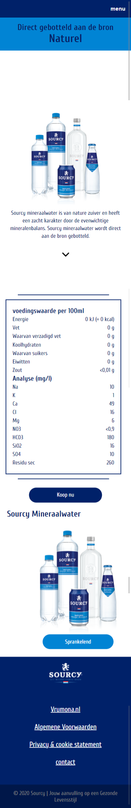

# Procesverslag

**Auteur:** Kai van Wezel

Markdown cheat cheet: [Hulp bij het schrijven van Markdown](https://github.com/adam-p/markdown-here/wiki/Markdown-Cheatsheet). Nb. de standaardstructuur en de spartaanse opmaak zijn helemaal prima. Het gaat om de inhoud van je procesverslag. Besteedt de tijd voor pracht en praal aan je website.

## Bronnenlijst

1. -bron 1-
2. -bron 2-
3. -...-

## Eindgesprek (week 7/8)

-dit ging goed & dit was lastig-

**Screenshot(s):**

-screenshot(s) van je eindresultaat-

## Voortgang 3 (week 6)

-same as voortgang 1-

## Voortgang 2 (week 5)

### Stand van zaken

Beide pagina's bevatten hun opmaak zoals de website van Sourcy zelf eruit ziet. Inmiddels is met wat hulp het horizontale scroll element ook gelukt. Nu gaan beginnen met Javascript en de surface plane. Verder was het deze week moeilijk om motivatie te krijgen om aan het werk te gaan. Ik vind het moeilijk om hard aan de slag te gaan en ben eigenlijk toe aan vakantie voor mijn gevoel.

Qua semantiek e.e.a. aangepast in de html wat voor wat moeilijkheden zorgde bij de sliders, maar dat is opgelost.

**Screenshot(s):**

_Screenshot 1_

De eerste pagina is volledig opgemaakt zoals die van Sourcy.

_Screenshot 2_

Productpagina is ook werkend, alleen de onderste producten slider werkt niet altijd mee. De ene keer geeft ie wel goed weer en soms loopt die net scheef. Deze moet ik nog even aandacht geven.

### Agenda voor meeting

-samen met je groepje opstellen-

| Kai                                          | Nienke | Lisa | Jeroen |
| -------------------------------------------- | ------ | ---- | ------ |
| Hoe veel wordt verwacht van de surface plane |        |      |        |
| Mag je libraries gebruiken?                  |        |      |        |
|                                              |        |      |        |

## Voortgang 1 (week 3)

### Stand van zaken

Eerste pagina qua markup gaat goed. Moeite gehad met overlappende content maar dat is opgelost.
Ik kon helaas het lettertype van Sourcy niet terugvinden dus ik heb een gelijksoortig lettertype gepakt.
Ben nog niet begonnen met javascript. Ik wil eerst alle css afmaken voordat ik ga programmeren. Dan is voor mij duidelijker wat er geprogrammeerd moet worden.

**Screenshot(s):**

_Screenshot 1_

Pagina ziet er hetzelfde uit. Menubalk is over alles heen gepositioneerd zodat deze altijd in beeld is. Kleur moet uiteraard nog aangepast worden, maar dit is voor het overzicht.

_Screenshot 2_

De productenslider werkt in principe. Alleen de knoppen moeten nog gepositioneerd worden en dan komt er javascript aan te pas. De 3 afbeeldingen moeten "snappen' (spreek uit als: "sneppen") en ook oneindig kunnen rondgaan.

### Agenda voor meeting

-samen met je groepje opstellen-

| Kai                                     | Nienke                           | Lisa                             | Jeroen           |
| --------------------------------------- | -------------------------------- | -------------------------------- | ---------------- |
| Verschil tussen mijn pagina en de echte | Overall look van huidige stavaza | Beste aanpak navigatie die slide | en dan ik dat    |
| Semantiek                               | Semantiek                        | Bewerking van ul                 | dit wil ik zeker |
| Bronnen (evt.)                          | Beste aanpak voor straks         | Iconen in een rij krijgen        | ...              |

### Verslag van meeting

Semantiek kan beter, verder zijn we goed bezig. Wat betreft de overeenkomsten hoeft het niet 1 op 1 te zijn, er mag een kleine variatie in zitten. Hierna ga je tenslotte met de surface plane aan de slag, dus als het goed is komt het er ook anders uit te zien.

Div's veranderd in ul > li, en enkele h1 veranderd in h2.

## Breakdownschets (week 1)

**breakdown home-pagina**

**breakdown van product-pagina**

## Intake (week 1)

**Je startniveau:** zwart

**Je focus:** surface plane

**Je opdracht:** https://www.sourcy.nl

**Screenshot(s) van de eerste pagina (small screen):**

**Screenshot(s) van de tweede pagina (small screen):**

